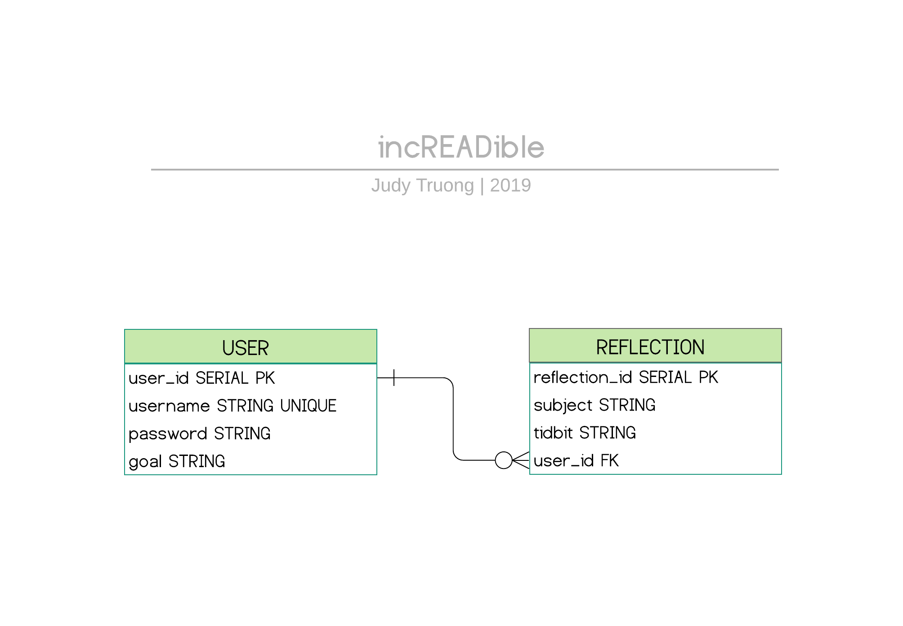

## incREADible | _by: <a href="https://https://github.com/judycodes">Judy Truong</a>_
Full Stack Application Focused on Learning & Reflection

### Getting Started

### Prerequisites

---

### [ incREADible Manual ]

#### _Enjoyed_
- Being inspired by and supporting my peers' progress
- Resolving unexpected bugs like delayed updates of the goal component and toggling of components
- Implementing more exceptions
- Learning new fact tidbits about different topics while discussing this project with my peers and throughout the development of this application

#### _Challenges_
- Microservices with Docker : Experienced errors with EntityFactoryManager when Eureka was added to my API 

#### _Mistakes/Failures_
- Spending too long trying to figure out setting up Docker with Microservices, rather than on other parts of the project, so early in the development process

#### _What would you do differently?_
- Allotted more time for research and exploring new tools for the development of this project

- Break out my React code into more components

#### _What would you add to improve this application?_

- Tags and or notebooks to categorize lists of reflections

- Allow users to upload files, images, and other media related to their reflection 

- Allow users to make their reflections private or public

- Add more frontend styling, like animations

---

### Built With
_Tools_
- Docker
- Postman
- DBeaver
- LucidChart
- Trello

_Frontend_
- React.js
- 3rd Party APIs - Catfact.ninja, Wikipedia

_Backend_
- Java (Spring Boot)
- PostgreSQL

#### incREADible Entity Relationship Diagram

#### incREADible Database Structure
- Increadible's database has two data models: User & Reflection
- Reflection model has `user_id` as a foreign key for reflections related to the user

#### _Relationships_
- A `User` can have zero or more reflections.
- Each `Reflection` is associated with only one `User`.

#### Wireframes
_Landing Design_  
   

_Home Page Design_  
   

_Create Reflection Page Design_  
   

_User Reflections Page Design_  
         

_About Page Design_  
   

#### User Stories
- As a User, I want to be able to log in and view my reflections so that I can devise a strategy for my personal growth and learning over time.
- As a User, I want to be able to search topics on my mind, so that I can have something to bring up when making small talk conversations and to ensure that I am continually learning.
- As a User, I want to create a goal and view my goal, so that I am able to notice and acknowledge my efforts toward accomplishing my stated personal or professional goal, as well as to hold myself accountable for my progress and growth.
- As a User, I want to be able to learn random cat facts, so that I can impress cat lovers everywhere. 

---

#### Day to Day Development
|                          Day 1                          |        Day 2        |                     Day 3                     |                          Day 4                          |                  Day 5                 |                     Day 6                     |                Day 7                |                      Day 8                     |          Day 9          |             Day 10            |                        Day 11                        |
|:-------------------------------------------------------:|:-------------------:|:---------------------------------------------:|:-------------------------------------------------------:|:--------------------------------------:|:---------------------------------------------:|:-----------------------------------:|:----------------------------------------------:|:-----------------------:|:-----------------------------:|:----------------------------------------------------:|
| User & Reflection - Model/Service/Repository/Controller | ERD designed        | Microservices debugging                       | Update Reflection subject and tidbit methods functional | Navbar minor styling                   | Microservices and Docker basic setup          | Wikipedia Search functional         | Token saved from login and signup              | Add and Update Goal     | Reorganized components layout | Frontend styling                                     |
| Checked User & Reflection Endpoints (with Postman)      | README.md created   | Restarting Spring Boot Monolith               | React Routing basic setup                               | Icon and logo added                    | Search and Result Components created          | Microservices configured and tested | Login and signup redirect functional           | Frontend styling        | Frontend error handling       | Frontend error handling                              |
| Spring Boot, Microservices, Github setup                | Wireframing         | Add goal, update goal, and get goal from User | User stories created                                    | Setup AWS EC2 instance and S3 storage  | Wikipedia Random Search and Search Form setup | Login and Signup components toggle  | Render and generate random fact                | Frontend error handling | Frontend styling              | About and Content Card components created and styled |
| Research & Application brainstorming                    | Microservices Error | Create React basic template                   | Research Microservices and Docker                       | Landing page setup                     |                                               | Signup functional                   | Create and Edit Reflection functionality added |                         |                               | AWS Deployment                                       |