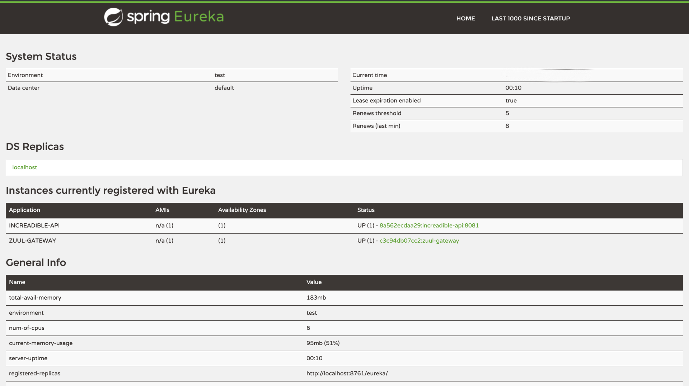
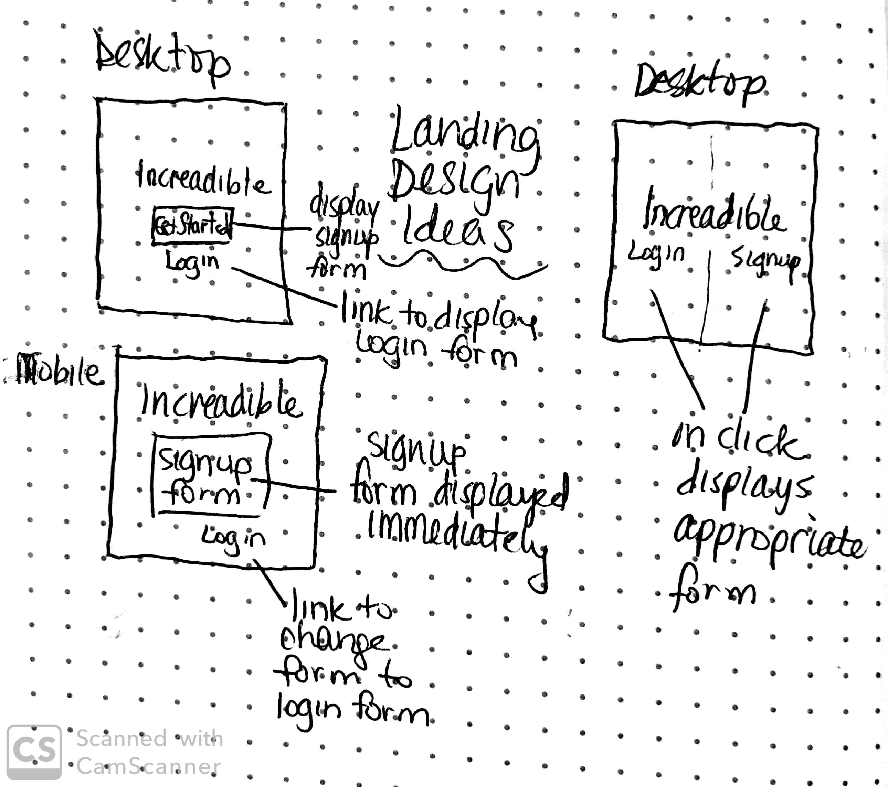
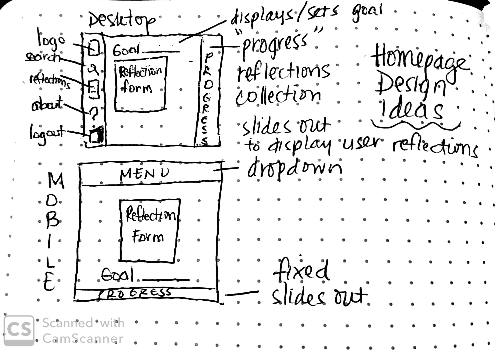
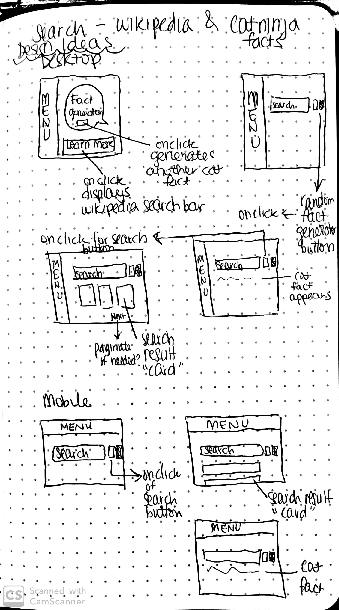

## incREADible | _by: <a href="https://https://github.com/judycodes">Judy Truong</a>_
Full Stack Application Focused on Learning & Reflection

### Getting Started
Get you a copy of Increadible up and running on your local machine for development and testing purposes by cloning this GitHub repository. 

* Just remember the data you input to the database when running this application will not persist if you stop and remove the containers with ```docker-compose down``` in your terminal. 

(If you are feeling lucky - and my wallet & bank account are feeling healthy 😉, this application may still be active and deployed on AWS, so check out: ```http://increadible-aws.s3-website-us-east-1.amazonaws.com/```. Otherwise, get this application on your local machine, following the instructions below and enjoy!)

### Prerequisites

This application requires:
* Docker
* Java 8

### Installing Locally

* Clone the GitHub repository to the directory of your choice in your terminal. 

```
cd 'directory of choice'/increadible
```

* Ensure that no processes are running on ports: ```8761```, ```8080```, ```5432```, ```8081```, and ```3000```.

```
Eureka server will run on port 8761.
Zuul gateway will run on port 8080.
postgreSQL will run on port 5432.
Increadible API will run on port 8081.
Increadible UI will run on port 3000. 
```

* Ensure that Docker Desktop is running on your local machine and ready for docker commands.

* In your terminal, create and start the containers required for the backend of this application to function by inputting the command below:

```
sudo docker-compose up   
```  

\* To check if this command was successful, in your terminal, input the following command: 

```
sudo docker ps -a
``` 

You should see:
```
CONTAINER ID        IMAGE               COMMAND                  CREATED             STATUS              PORTS                    NAMES
000000000000        maven:3.6.1-jdk-8   "/usr/local/bin/mvn-…"   14 hours ago        Up 14 hours         0.0.0.0:8081->8081/tcp   increadible_increadible-api_1
000000000000        maven:3.6.1-jdk-8   "/usr/local/bin/mvn-…"   14 hours ago        Up 14 hours         0.0.0.0:8080->8080/tcp   increadible_zuul-gateway_1
000000000000        maven:3.6.1-jdk-8   "/usr/local/bin/mvn-…"   14 hours ago        Up 14 hours         0.0.0.0:8761->8761/tcp   increadible_eureka_1
000000000000        postgres            "docker-entrypoint.s…"   14 hours ago        Up 14 hours         0.0.0.0:5432->5432/tcp   increadible_postgres_1
```

Input the following command:
 
```
sudo docker network ls
```

You should also see: 
```
NETWORK ID          NAME                  DRIVER              SCOPE
000000000000        bridge                bridge              local
000000000000        host                  host                local
000000000000        increadible_default   bridge              local
000000000000        none                  null                local
```

In your browser of choice, you should see the Spring Eureka dashboard and the following (specifically INCREADIBLE-API and ZUUL-GATEWAY under Application):


<br/>

* Open another terminal tab and cd into the application's frontend directory. 

```
cd 'directory of choice'/increadible/client
```

* In same terminal, run the following command in order to bring up the UI of this application:

```
npm run start
```

** This application was tested on the Chrome browser **

** If all statuses are up for the containers and you see the following in your browser, you are all set to navigate and interact with Increadible. Suggestion: Create an account first by clicking on the Get Started button on the landing page! ** 


---

### [ incREADible - The Development Experience ]

#### _Enjoyed_
- Being inspired by and supporting my peers' progress
- Resolving unexpected bugs like delayed updates of the goal component and toggling of components
- Implementing more exceptions
- Learning new fact tidbits about different topics while discussing this project with my peers and throughout the development of this application

#### _Challenges_
- Microservices with Docker : Experienced errors with EntityFactoryManager when Eureka was added to my API & had to git reset numerous times before finally deciding to start my backend over from scratch <br/> (Days later, I realized the problem was just my API's application properties configuration) 

#### _Mistakes/Failures_
- Spending too long trying to figure out setting up Docker with Microservices, rather than on other parts of the project, so early in the development process

#### _What would you do differently?_
- Allotted more time for research and exploring new tools for the development of this project

- Break out my React code into more components

#### _What would you add to improve this application?_

- Tags and or notebooks to categorize lists of reflections

- Allow users to upload files, images, and other media related to their reflection 

- Allow users to make their reflections private or public

- Add more frontend styling, like animations

- Connect goals to reflections, for future search by goal filtering functionality

---

### Built With
_Tools_
- Docker
- Postman
- DBeaver
- LucidChart
- Trello

_Frontend_
- React.js
- 3rd Party APIs - Catfact.ninja, Wikipedia

_Backend_
- Java (Spring Boot)
- PostgreSQL

#### incREADible Entity Relationship Diagram


#### incREADible Database Structure
- Increadible's database has two data models: User & Reflection
- Reflection model has `user_id` as a foreign key for reflections related to the user

#### _Relationships_
- A `User` can have zero or more reflections.
- Each `Reflection` is associated with only one `User`.

#### Wireframes
_Landing Design_ <br/>
   

_Home Page Design_ <br/>
   

_Search Page Design_ <br/>
   

#### User Stories
- As a User, I want to be able to log in and view my reflections so that I can devise a strategy for my personal growth and learning over time.
- As a User, I want to be able to search topics on my mind, so that I can have something to bring up when making small talk conversations and to ensure that I am continually learning.
- As a User, I want to create a goal and view my goal, so that I am able to notice and acknowledge my efforts toward accomplishing my stated personal or professional goal, as well as to hold myself accountable for my progress and growth.
- As a User, I want to be able to learn random cat facts, so that I can impress cat lovers everywhere. 

---

#### Day to Day Development
|                          Day 1                          |        Day 2        |                     Day 3                     |                          Day 4                          |                  Day 5                 |                     Day 6                     |                Day 7                |                      Day 8                     |          Day 9          |             Day 10            |                        Day 11                        |
|:-------------------------------------------------------:|:-------------------:|:---------------------------------------------:|:-------------------------------------------------------:|:--------------------------------------:|:---------------------------------------------:|:-----------------------------------:|:----------------------------------------------:|:-----------------------:|:-----------------------------:|:----------------------------------------------------:|
| User & Reflection - Model/Service/Repository/Controller | ERD designed        | Microservices debugging                       | Update Reflection subject and tidbit methods functional | Navbar minor styling                   | Microservices and Docker basic setup          | Wikipedia Search functional         | Token saved from login and signup              | Add and Update Goal     | Reorganized components layout | Frontend styling                                     |
| Checked User & Reflection Endpoints (with Postman)      | README.md created   | Restarting Spring Boot Monolith               | React Routing basic setup                               | Icon and logo added                    | Search and Result Components created          | Microservices configured and tested | Login and signup redirect functional           | Frontend styling        | Frontend error handling       | Frontend error handling                              |
| Spring Boot, Microservices, Github setup                | Wireframing         | Add goal, update goal, and get goal from User | User stories created                                    | Setup AWS EC2 instance and S3 storage  | Wikipedia Random Search and Search Form setup | Login and Signup components toggle  | Render and generate random fact                | Frontend error handling | Frontend styling              | About and Content Card components created and styled |
| Research & Application brainstorming                    | Microservices Error | Create React basic template                   | Research Microservices and Docker                       | Landing page setup                     |                                               | Signup functional                   | Create and Edit Reflection functionality added |                         |                               | AWS Deployment                                       |


## Thank you for visiting and exploring Increadible!

### May you continue to be INCREDIBLE & use Increadible! 